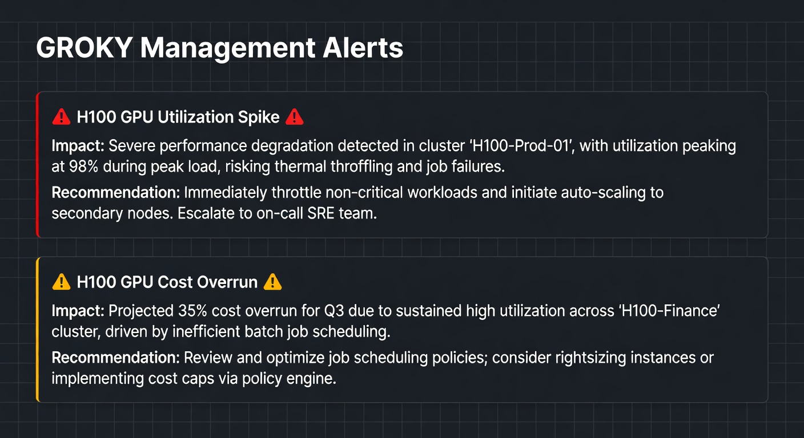
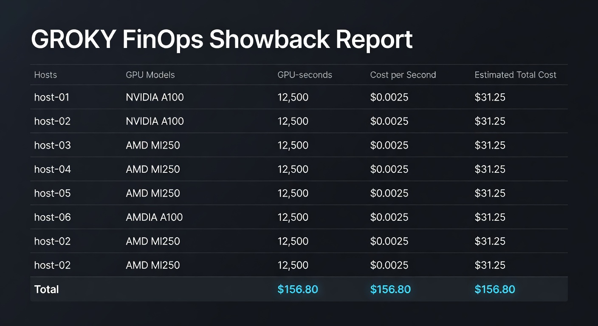
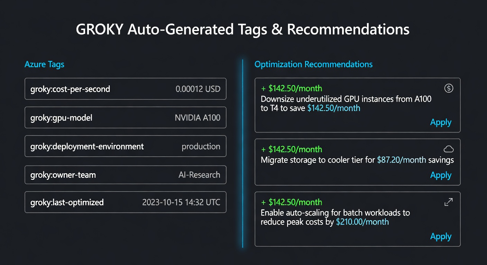

# AVD Masters

**The professional GPU monitoring and management platform for Azure Virtual Desktop.**

> Direct hardware truth. Real alerts. Actionable intelligence.  
> Zero Azure Monitor tax.

[](https://www.python.org/)
[](https://opensource.org/licenses/MIT)
[](https://github.com/tkhemraj/avd-masters)
[](https://github.com/tkhemraj/avd-masters)

---

## The Problem

Most tools for monitoring GPU workloads on AVD are either:

- **Expensive** — Heavy reliance on Azure Monitor + Log Analytics
- **Inaccurate** — Sampled data that fails on fractional GPUs
- **Shallow** — Pretty dashboards with very little actionable value

**AVD Masters exists to fix this.**

---

## What GROKY Actually Delivers

| Area                    | What You Get                                                                 |
|-------------------------|-------------------------------------------------------------------------------|
| **Hardware Truth**      | Direct `nvidia-smi` / `rocm-smi` collection. No sampling lies.               |
| **Fractional GPUs**     | Proper modeling of 1/6, 1/3, 1/2 partitions (most tools get this wrong)       |
| **Modern Hardware**     | 41+ current SKUs including H100, H200, MI300X, L40S, etc.                    |
| **Real Alerts**         | Actionable alerts on utilization, cost, imbalance, and forecasting           |
| **FinOps Visibility**   | Accurate cost-per-second + auto-generated Azure cost tags                    |
| **Intelligence**        | Forecasting, optimization recommendations, and governance                    |

---

### Real Output Examples

GROKY produces professional, usable artifacts — not just raw metrics.

**Management Alerts**  
Actionable alerts with clear impact and recommended actions.



**FinOps Showback Report**  
Finance-ready cost attribution with per-host breakdown.



**Tags + Optimization Recommendations**  
Ready-to-apply Azure tags and prioritized savings opportunities.



---

## Quick Start

```bash
git clone https://github.com/tkhemraj/avd-masters.git
cd avd-masters

pip install -r requirements.txt
cp .env.example .env
# Configure your Azure + WinRM/SSH access

python run.py
```

Then open **http://localhost:8080**

---

### Useful Commands

```bash
python run.py                 # Basic status + catalog
python run.py alerts          # Run full management + alerting session
python run.py cost            # Live FinOps cost attribution demo
python run.py forecast        # Predictive cost forecasting demo
```

---

## Documentation

| Document                    | Purpose                                      |
|----------------------------|----------------------------------------------|
| [FEATURES.md](FEATURES.md) | Enterprise features for Microsoft customers  |
| [MEGA-FEATURES.md](MEGA-FEATURES.md) | Ambitious long-term vision & platform direction |
| [docs/index.html](docs/index.html) | Beautiful interactive product demo           |

---

## Philosophy

- **Direct over sampled** — We talk to the metal.
- **Useful over pretty** — Alerts and recommendations that help you manage.
- **Low cost by default** — No forced expensive Azure services.
- **Enterprise ready** — Built with FinOps, governance, and large-scale operations in mind.
- **CMMC 2.0 aware** — Governance layer aligned with the U.S. DoD Cybersecurity Maturity Model Certification (NIST 800-171) because a large portion of serious AVD GPU workloads live in the defense contractor and federal ecosystem.

---

## Current Focus

We are actively building real, usable management capabilities:

- Midas Touch intelligence (the signature "everything it touches turns to gold" experience)
- Real utilization signals layer for accurate idle/waste detection
- Governance + Fleet Health + cross-sub visibility, with explicit CMMC 2.0 alignment (see `governance.py` for the rationale)
- One-command `touch` that does discovery → analysis → tagging → playbooks
- Strong CLI with Grok-grade direct, high-signal output

This is not a marketing project. It's a tool designed to help teams that actually run expensive GPU infrastructure on Azure.

---

## License

MIT License — Use it, fork it, improve it.

---

**Built for people who need to know what's actually happening with their GPUs — and what to do about it.**
