# GROKY 2.0

**The GPU monitor for Azure Virtual Desktop that actually respects the silicon.**

> Agentless. Direct. Brutally honest. Zero Azure Monitor tax.

[](https://www.python.org/)
[](https://opensource.org/licenses/MIT)
[](https://github.com/tkhemraj/groky)
[](https://github.com/tkhemraj/groky)

---

## What is GROKY?

Most AVD GPU monitoring tools are either:
- Expensive (Azure Monitor + Log Analytics)
- Inaccurate (sampled metrics that lie about fractional GPUs)
- Outdated (still living in 2025 while you're running H100s and H200s)

**GROKY 2.0 is different.**

It talks directly to the GPUs on your session hosts using `nvidia-smi` and `rocm-smi`.  
No agents. No ingestion bills. No guessing.

The goal is simple: **Help you actually manage your expensive GPU environment** — with real alerts, cost visibility, and actionable recommendations — not just pretty dashboards.

---

## Why GROKY 2.0 is Hot

| Feature                        | GROKY 2.0                          | Typical Tools                     |
|--------------------------------|------------------------------------|-----------------------------------|
| **Hardware Truth**             | Direct `nvidia-smi` / `rocm-smi`   | Sampled / approximated            |
| **Fractional GPUs**            | First-class (1/6, 1/3, 1/2...)     | Often treated as whole GPUs       |
| **Modern SKUs**                | 41+ real 2026-era SKUs (H100/H200) | 2024-2025 data                    |
| **Cost**                       | Basically free                     | Can get expensive fast            |
| **Imbalance Detection**        | Brutally accurate CV + heavy hosts | Basic averages                    |
| **Catalog Quality**            | Rich `GpuSpec` with computed props | Static lists                      |

---

## Architecture

```mermaid
flowchart TD
    A[Azure AVD Host Pools] -->|Discovery| B(GROKY Engine)
    C[Session Hosts] -->|WinRM / SSH| B
    B -->|nvidia-smi / rocm-smi| D[Direct GPU Metrics]
    B --> E[(SQLite)]
    B --> F[FastAPI Backend]
    F --> G[Web Dashboard]
    F --> H[REST API]
    
    style B fill:#1f2937,stroke:#f59e0b,stroke-width:2px,color:#fff
    style D fill:#064e3b,stroke:#10b981
```



---

## The Catalog (Our Crown Jewel)

GROKY ships with the best GPU SKU catalog in the game.

```bash
python -c "
import groky.catalog as c
print(c.lookup('Standard_ND96isr_H200_v5').pretty())
print(c.lookup('Standard_NC4ads_H100_v5').pretty())
"
```

**Highlights:**
- Proper H100 & H200 fractional + full nodes
- MI300X 8x dense nodes
- L40S, professional RTX series
- All current AMD graphics partitions
- Rich methods: `.is_fractional`, `.vram_gb`, `.pretty()`

See the full catalog: [docs/catalog.md](docs/catalog.md)

**New in GROKY 2.0:** Real FinOps cost attribution. We can now calculate accurate cost-per-GPU-second and generate Azure tags automatically. This is a game changer for enterprise chargeback and cost optimization.

---

## Quick Start

```bash
git clone https://github.com/tkhemraj/groky.git
cd groky

pip install -r requirements.txt

cp .env.example .env
# Edit with your Azure credentials + WinRM/SSH access

python run.py
```

Then open **http://localhost:8080**.

The first collection happens immediately.

**Prefer to see it first?**  
→ **[Open the premium interactive demo →](docs/index.html)** (beautiful, no install required)

**See real cost attribution in action:**  
→ `python examples/finops_demo.py`

**Run the management + alerting session:**
→ `python run.py alerts`

**Other useful commands:**
- `python run.py` — basic status + catalog
- `python run.py cost`
- `python run.py forecast`

---

## Current State

We're building this in public with high standards.

**Already excellent:**
- World-class GPU catalog (41 SKUs, rich models)
- Clean modern Pydantic data layer
- Strong architectural foundation
- Early FinOps cost attribution (cost per second + auto-tagging)

**High-value enterprise features in progress:**
- Real cost attribution & Azure auto-tagging
- Optimization recommendations with dollar impact
- Governance & policy engine
- Chargeback / showback reporting
- Lightweight Azure integration (Event Grid, Logic Apps, etc.)

**Mega Features** (next level ambition):
- Predictive Cost Forecasting
- Intelligent Workload Placement Optimizer
- Automated Remediation Playbooks
- Carbon & Sustainability Intelligence
- Cross-Subscription Command Center

See [MEGA-FEATURES.md](MEGA-FEATURES.md) for the full vision.

---

## Philosophy

We believe monitoring should tell the truth — even when it's inconvenient.

We believe you shouldn't have to pay per gigabyte to know if your H100s are actually working.

We believe fractional GPUs deserve to be treated like adults.

If that resonates, welcome.

---

## Contributing

This project is early but held to a high bar. If you want to help build something that actually feels premium, reach out.

---

**MIT License** — Use it. Fork it. Make it better.

*Built with pride. No compromises on truth.*
