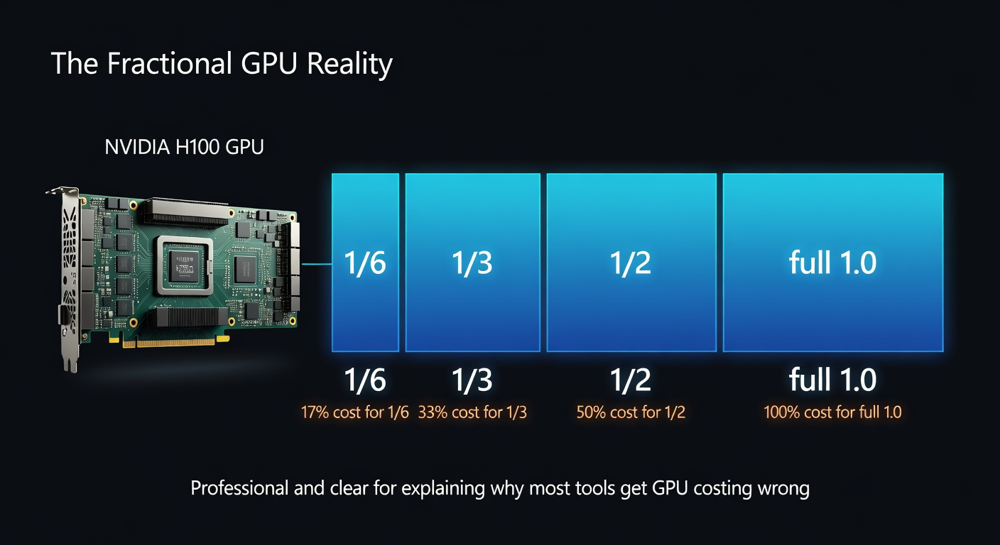
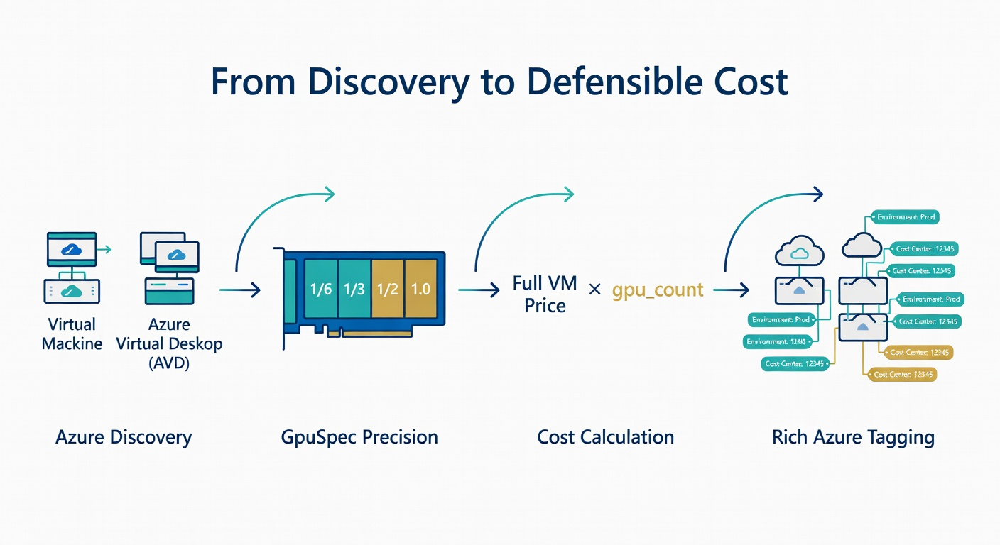
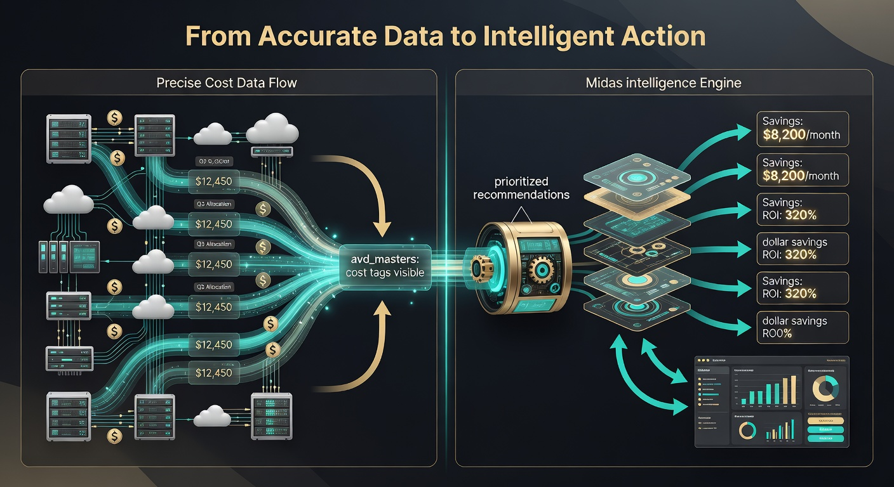

# The Precision Engine

**Why AVD Masters Cost Attribution Is Actually Reliable in the Real World**

Most tools that claim to show the true cost of your AVD GPU workloads are quietly lying to you.

They do it in small, expensive ways — averaging prices, ignoring fractional allocations, or relying on sampled data that slowly drifts from reality. Over time, these inaccuracies turn into chargeback reports that finance teams stop trusting and optimization projects that chase the wrong problems.

AVD Masters was built on a different belief: if you're going to make expensive decisions about GPU infrastructure, the numbers have to hold up when someone asks hard questions.

This is how it actually works.

---

## The Core Problem Most Tools Never Solve

When you run GPU workloads on Azure Virtual Desktop, you are often not buying full physical GPUs.

You are buying partitions.

A single physical H100 can be carved into six, three, two, or one logical GPUs depending on the SKU you chose. The cost implications are enormous.

Yet most monitoring and cost tools treat every "H100 VM" the same. They apply a flat rate or an average. The result is distorted economics that make real optimization nearly impossible.

AVD Masters refuses to play that game.



---

## The Three Foundations of Accuracy

### 1. Authoritative Discovery, Not Configuration Guesses

Everything starts with truth.

AVD Masters does not ask you what SKUs you believe are running. It asks Azure directly.

Through the AVD and Compute management APIs, it walks from each Session Host back to its actual virtual machine and retrieves the precise `vmSize`. This single step removes one of the most common (and costly) sources of error in the industry: the gap between what people think is deployed and what is actually consuming budget.

### 2. The GpuSpec: The Atomic Truth

At the heart of the system sits the `GpuSpec` — a precise, versioned description of exactly what each Azure SKU delivers.

```python
"standard_nc4ads_h100_v5":  GpuSpec(NVIDIA, "H100", 1/6,  8192, ...),
"standard_nc8ads_h100_v5":  GpuSpec(NVIDIA, "H100", 1/3,  16384, ...),
"standard_nc32ads_h100_v5": GpuSpec(NVIDIA, "H100", 1.0,  81920, ...),
```

This model captures the real fractional share (`gpu_count`), the actual VRAM allocated, the generation, and retirement status. It is not marketing data. It is the single source of truth from which all cost and intelligence calculations flow.

### 3. The Correct Multiplication

Cost is calculated as:

**Full VM Hourly Price × gpu_count**

The system first obtains the real hourly price for the specific SKU (via the live Azure Retail Prices API, with high-quality curated fallbacks when needed). It then scales that price by the exact fractional share the host actually receives.

A full H100 VM might carry a $4.50/hour VM price.  
A 1/6 partition of the same hardware is correctly attributed ~$0.75/hour for the GPU portion.

This is the difference between a rough estimate and a number you can defend.

---

## How It Identifies What to Tag and Assigns Cost

The flow is deliberate and traceable:

1. **Discovery** walks your AVD estate and resolves every GPU-capable session host to its actual SKU and region.
2. It retrieves or dynamically enriches the corresponding `GpuSpec`.
3. It calls `generate_cost_tags()`, which performs the precise calculation above.
4. Rich, consistent tags are produced:

   - `avd_masters:gpu-model`
   - `avd_masters:gpu-count`
   - `avd_masters:cost-per-hour`
   - `avd_masters:cost-per-second`
   - `avd_masters:total-cost-estimate`
   - `avd_masters:last-calculated`

These tags can be applied directly to resources, used for chargeback, fed into FinOps platforms, or exported as evidence.



Currently the system produces capacity-based costing (what the allocation is capable of consuming). The architecture was intentionally designed so that once real utilization data arrives through the Signals layer, the same engine can shift to true consumption-based attribution without structural changes.

---

## From Precise Data to Genuine Intelligence

This same foundation is what makes the Midas intelligence engine powerful.

When Midas evaluates a host running a 1/6 H100 partition at low utilization, it is not guessing. It knows:

- The exact SKU
- The precise fractional share
- The real cost that share carries
- The realistic alternatives (L40S, A10, etc.)

This allows it to surface recommendations with genuine financial weight rather than generic advice.



The result is intelligence you can actually act on — and defend.

---

## The Real-World Difference

In organizations running serious GPU estates, especially those under regulatory scrutiny, the ability to speak with precision about both cost and control is rare.

AVD Masters gives you numbers that are grounded in what Azure is actually billing you for, scaled by what you are actually consuming, and expressed in language that both engineers and executives can trust.

That is the difference between another monitoring tool and a decision-grade platform.

---

*This level of precision is not an accident. It is the direct result of refusing to accept the approximations that have become normal in GPU cost management.*

**If you're ready to stop guessing about the most expensive resources in your environment, the foundation is already here.**

---

## New: Latency & User Experience as First-Class Citizens

AVD Masters now treats **user experience** with the same rigor as cost.

The Signals layer has been extended with:

- `p95_frame_time_ms` (the real killer of "it feels slow")
- `input_latency_ms` (end-to-end input to screen)
- Network and encoding latency fields

Midas now surfaces opportunities like **"bad_experience_on_expensive_hardware"** — because paying premium prices for hardware that delivers janky performance is the most painful form of waste.

This is the beginning of turning AVD Masters from a cost tool into the complete operating system for high-performance, high-expectation AVD environments.

---

**Next steps**

- Run `python run.py touch` to see the current tagging and analysis in action.
- Review `governance.py` for CMMC-aligned cost governance patterns.
- Enable email alerting in `alerting.py` to be notified when material cost or risk situations emerge.

The truth is available. The only question is whether you're ready to act on it.